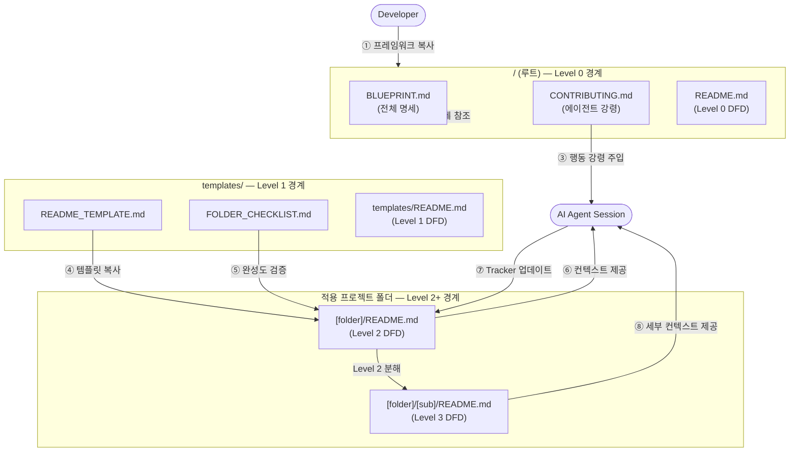
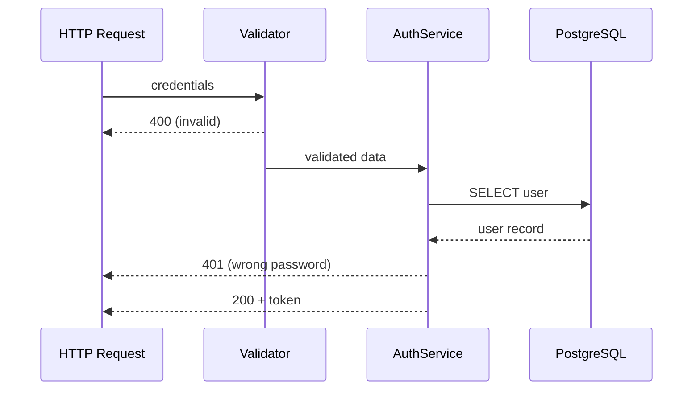
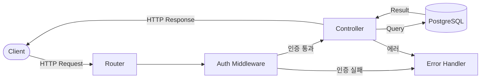
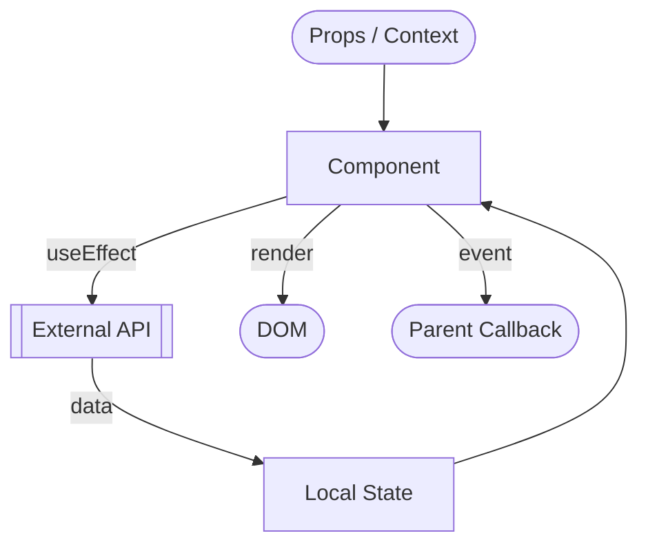
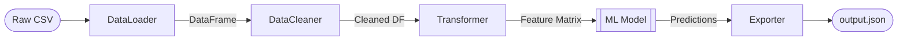
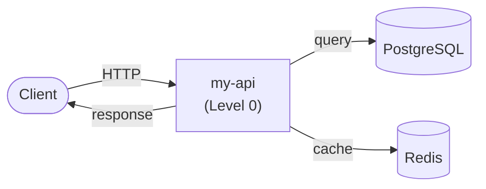
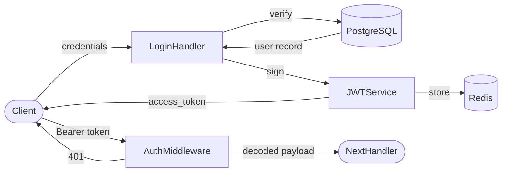
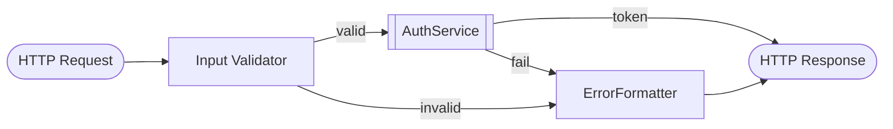

# Blueprint Framework — Master Document

> 이 문서는 Project Blueprint Framework의 전체 명세입니다.  
> 에이전트와 개발자 모두를 위한 **단일 진실 공급원(Single Source of Truth)** 입니다.

---

## DFD — Level 1 (Main Processes)

> Decomposed from: `/` Level 0 — Context Diagram  
> 이 레벨은 Blueprint Framework 내부의 **주요 구성 문서들이 어떻게 연동**되는지를 나타냅니다.



---

## 목차

1. [프레임워크 개요](#1-프레임워크-개요)
2. [폴더 README 구조 명세](#2-폴더-readme-구조-명세)
3. [DFD 작성 가이드](#3-dfd-작성-가이드)
   - [3-1. DFD 레벨링 규칙](#3-1-dfd-레벨링-규칙)
4. [Progress Tracker 규칙](#4-progress-tracker-규칙)
5. [Agent Control 섹션 규칙](#5-agent-control-섹션-규칙)
6. [폴더 소유권 모델](#6-폴더-소유권-모델)
7. [전체 적용 예시](#7-전체-적용-예시)

---

## 1. 프레임워크 개요

### 배경

AI 에이전트는 단일 파일 수준에서는 탁월한 성능을 보이지만,  
**프로젝트 전체 맥락**을 유지하면서 작업할 때 다음 문제가 발생합니다:

- 데이터 흐름을 오해해 의도치 않은 사이드 이펙트 발생
- 이미 구현된 기능을 중복 구현하거나 미구현 기능을 건너뜀
- 폴더별 아키텍처 원칙(Pure Function, 의존성 제한 등)을 무시

### 해결책

Blueprint Framework는 **각 폴더의 `README.md`를 에이전트의 컨텍스트 문서로 활용**합니다.  
에이전트가 작업 전 이 문서를 읽도록 강제함으로써 위 문제를 구조적으로 차단합니다.

### 프레임워크 구성 파일

| 파일 | 역할 | 읽는 시점 |
|------|------|-----------|
| `CLAUDE.md` | Claude Code 자동 로딩 — 세션 프로토콜·핵심 규칙 | **매 세션 자동** |
| `AGENT_STATE.md` | 누적 요구사항·진행 상태·세션 로그 | 매 세션 수동 (CLAUDE.md 지시) |
| `AGENT_BOOTSTRAP.md` | 최초 1회 초기화 — 전체 규칙 요약, STATE 생성 지시 | **최초 1회 후 삭제** |
| `[폴더]/README.md` | 폴더별 Context·DFD·Agent Control | 작업 대상 폴더 진입 시 |
| `BLUEPRINT.md` | 프레임워크 전체 명세 (이 파일) | **세션 중 읽지 않음** |
| `CONTRIBUTING.md` | 상세 프로토콜·드리프트 감지·팀 규칙 | **세션 중 읽지 않음** |

---

## 2. 폴더 README 구조 명세

폴더 유형에 따라 **두 가지 구조** 중 하나를 사용합니다.  
유형 결정은 `templates/FOLDER_CHECKLIST.md Step 1`을 참고하세요.

### 최상위(소유자) 폴더 — `README_TEMPLATE_TOP.md` 사용

Progress Tracker와 Roadmap을 **소유**하는 폴더입니다.

```
## [시스템명] Overview         # 시스템 전체 책임 (1~2문장)
## DFD — Level 0 (Context)    # 시스템을 단일 버블로, 외부 액터만 표시
## Tech Stack                  # 전체 스택 정의
## Agent Control               # 전체 시스템 최상위 제약 (하위 상속)
## Sub-folder Map              # 하위 폴더 ↔ Feature 매핑 테이블
## Progress Tracker            # ← 진행도 유일 정의 지점
## Next Roadmap                # ← 방향성 유일 정의 지점
```

### 하위(실행자) 폴더 — `README_TEMPLATE_SUB.md` 사용

DFD로 구현 흐름을 상세화하는 폴더입니다. **Tracker·Roadmap 없음.**

```
## [폴더명] Overview           # 이 폴더의 책임 (1~2문장)
## Context — 상위 흐름과의 연결 # 상위 Tracker 항목 참조 + 입출력 명시
## DFD — Level N (레벨명)      # 상위 버블을 분해한 상세 흐름
## Tech Stack                  # 상위에서 미명시된 추가 스택만
## Agent Control               # 상위 규칙 상속 + 이 폴더 추가 제약
```

> ⚠️ 에이전트는 BLUEPRINT.md를 세션 중 읽지 않습니다.  
> 세션 시작 시 `CLAUDE.md` → `AGENT_STATE.md` → 작업 대상 폴더 `README.md` 순으로만 읽습니다.

---

## 3. DFD 작성 가이드

### 목적

mermaid `flowchart` 또는 `sequenceDiagram`을 사용해 이 폴더가 처리하는  
**데이터의 진입점(Input) → 처리(Process) → 출력(Output)** 을 명시합니다.

에이전트는 이 다이어그램을 읽고, 자신이 수정할 코드가 이 흐름을 깨는지 검토해야 합니다.

---

### 3-1. DFD 레벨링 규칙

폴더 깊이에 따라 DFD의 **추상화 수준**이 결정됩니다.  
상위 DFD의 버블(Process) 하나를 하위 DFD 전체로 확대(Decompose)하는 방식입니다.

#### 레벨별 정의

| 레벨 | 폴더 깊이 | 표현 범위 | 헤더 표기 |
|------|-----------|-----------|-----------|
| **Level 0** | 루트 `/` | 시스템 전체를 단일 버블로, 외부 액터와 경계만 표시 | `## DFD — Level 0 (Context Diagram)` |
| **Level 1** | 1단계 하위 (`/src`, `/api` 등) | 루트의 단일 버블을 주요 서브시스템으로 분해 | `## DFD — Level 1 (Main Processes)` |
| **Level 2** | 2단계 하위 (`/src/auth` 등) | Level 1의 버블 하나를 모듈 내부 흐름으로 분해 | `## DFD — Level 2 (Detailed Processes)` |
| **Level 3+** | 3단계+ (`/src/auth/handlers` 등) | 함수/컴포넌트 수준의 입출력 | `## DFD — Level 3 (Function Level)` |

#### 필수 표기 규칙

각 DFD 섹션 헤더 바로 아래에 **어느 상위 버블을 분해했는지** 반드시 명시합니다:

```markdown
## DFD — Level 2 (Detailed Processes)

> Decomposed from: `/src` Level 1 — `[Auth Process]` 버블
```

#### 레벨 간 일관성 규칙

- 하위 DFD의 **외부 입력/출력**은 상위 DFD에서 해당 버블로 들어오고 나가는 화살표와 **정확히 일치**해야 합니다.
- 상위 DFD에 없는 외부 의존성이 하위 DFD에 등장할 경우, **상위 DFD도 함께 업데이트**해야 합니다.
- 에이전트는 하위 폴더 작업 전 상위 폴더의 DFD를 읽어 자신이 수정할 버블의 입출력을 확인해야 합니다.

#### 레벨링 시각화 예시

```
/ (Level 0)
└─ [ Blueprint Framework ] ──────────────────────────────────── 단일 버블
        │
        ▼ Decompose
/templates (Level 1)
└─ [ Template Copy ] → [ README 생성 ] → [ 검증 ] ────────── 서브프로세스 분해
                              │
                              ▼ Decompose
/templates/partials (Level 2)
└─ [ DFD 섹션 생성 ] → [ Tracker 섹션 생성 ] → [ Control 섹션 생성 ] ── 내부 상세
                              │
                              ▼ Decompose
/templates/partials/dfd (Level 3)
└─ [ mermaid 파싱 ] → [ 노드 추출 ] → [ 화살표 검증 ] ── 함수 수준
```

#### Level 3+ 작성 지침

Level 3부터는 **함수/컴포넌트 단위**로 DFD를 그립니다.  
모든 폴더가 Level 3 DFD를 가질 필요는 없습니다 — 아래 조건일 때만 작성합니다:

- 이 폴더 내부에 **5개 이상의 함수/클래스**가 상호작용하는 경우
- 에이전트가 반복적으로 이 폴더에서 버그를 발생시킨 경우
- 보안·성능상 흐름이 정확해야 하는 폴더 (인증, 결제, 암호화 등)

Level 3+ DFD는 `sequenceDiagram`을 사용해도 됩니다:



---

### 작성 규칙 (공통)

- `mermaid` 코드 블록 안에 작성
- 노드 이름은 영어, 화살표 레이블은 한/영 혼용 가능
- 외부 시스템(DB, API, 다른 모듈)은 `[[ ]]` 또는 `[(DB)]` 표기
- 변경 시 반드시 에이전트가 업데이트하며, 하위→상위 일관성 검토 포함

### 예시 — REST API 서버의 `/api` 폴더



### 예시 — React 컴포넌트 폴더



### 예시 — Python 데이터 파이프라인



---

## 4. Progress Tracker 규칙

### 목적

`git log` 없이도 **무엇이 구현되었고, 무엇이 남았는지** 즉시 파악할 수 있게 합니다.

### 테이블 형식

```markdown
| Feature | Status | Assignee | Last Updated | Notes |
|---------|--------|----------|--------------|-------|
| 기능명  | ✅ Done / 🔄 In Progress / ⏳ Pending / ❌ Blocked | 담당자 또는 Agent | YYYY-MM-DD | 비고 |
```

### 상태 이모지 기준

| 이모지 | 상태 | 의미 |
|--------|------|------|
| ✅ | Done | 구현 완료 및 테스트 통과 |
| 🔄 | In Progress | 현재 작업 중 |
| ⏳ | Pending | 아직 시작 안 함 |
| ❌ | Blocked | 외부 의존성 또는 버그로 차단 |

### 에이전트 업데이트 의무

- 작업을 시작하면 해당 Feature의 상태를 `🔄 In Progress`로 변경
- 작업을 완료하면 `✅ Done`으로 변경하고 `Last Updated`를 오늘 날짜로 수정
- 새 기능을 추가하면 반드시 새 행을 삽입
- 블로커 발견 시 `❌ Blocked`로 변경하고 Notes에 이유 기재

---

## 5. Agent Control 섹션 규칙

### 목적

이 섹션은 에이전트에 대한 **폴더 수준의 System Prompt**입니다.  
에이전트는 이 섹션의 규칙을 코드 생성 전 반드시 읽고 준수해야 합니다.

### 작성 형식

```markdown
## Agent Control

> 이 섹션의 규칙은 에이전트가 이 폴더의 코드를 수정할 때 반드시 따라야 합니다.

### 허용 (Allow)
- ...

### 금지 (Prohibit)
- ...

### 필수 (Required)
- ...
```

### 예시 — 유틸리티 함수 폴더

```markdown
## Agent Control

### 허용
- 순수 함수(Pure Function) 작성
- TypeScript 내장 타입 사용
- 단위 테스트 파일 추가

### 금지
- 외부 npm 패키지 import 금지
- 전역 상태(global state) 참조 금지
- 비동기(async/await) 함수 금지

### 필수
- 모든 함수는 JSDoc 주석 포함
- 함수 하나당 단일 책임 원칙 준수
- 에러는 throw 대신 Result 타입으로 반환
```

### 예시 — API 라우터 폴더

```markdown
## Agent Control

### 허용
- Express Router 사용
- 기존 미들웨어 체인 활용

### 금지
- 라우터 파일 내 비즈니스 로직 직접 작성 금지 (Controller로 위임)
- DB 직접 쿼리 금지 (Service 레이어 경유 필수)

### 필수
- 새 엔드포인트 추가 시 DFD 업데이트
- 모든 라우트에 인증 미들웨어 적용
- HTTP 상태 코드는 RFC 7231 표준 준수
```

---

## 6. 폴더 소유권 모델

### 핵심 원칙

> **"무엇을 해야 하나(What)"는 상위에서만 정의하고,**  
> **"어떻게 흐르는가(How)"는 하위로 내려갈수록 상세해진다.**

Progress Tracker와 Roadmap은 **최상위 폴더(소유자)에만 존재**합니다.  
하위 폴더는 상위의 정의를 참조하며, DFD를 통해 자신의 구현 흐름을 상세화합니다.

### 폴더 유형별 README 구성

```
┌─────────────────────────────────────────────────────────────┐
│  📁 최상위 폴더 (소유자)                                      │
│     템플릿: README_TEMPLATE_TOP.md                           │
│                                                             │
│     ✅ DFD — Level 0 (Context)    ← 시스템 경계 정의         │
│     ✅ Tech Stack                 ← 전체 스택 정의            │
│     ✅ Agent Control              ← 전체 시스템 규칙 (최상위) │
│     ✅ Sub-folder Map             ← 하위 폴더 ↔ Feature 매핑  │
│     ✅ Progress Tracker           ← 유일한 진행도 정의        │
│     ✅ Next Roadmap               ← 유일한 방향성 정의        │
└──────────────────┬──────────────────────────────────────────┘
                   │  DFD 분해(Decompose) + 작업 위임
┌──────────────────▼──────────────────────────────────────────┐
│  📁 1단계 하위 폴더                                           │
│     템플릿: README_TEMPLATE_SUB.md                          │
│                                                             │
│     ✅ Context (상위 Tracker 항목 참조)  ← 상위와 연결        │
│     ✅ DFD — Level 1 (Main Processes)  ← 상위 버블 분해      │
│     ✅ Tech Stack (추가분만)                                  │
│     ✅ Agent Control (상위 규칙 상속 + 추가)                  │
│     ❌ Progress Tracker 없음            ← 상위가 소유         │
│     ❌ Next Roadmap 없음               ← 상위가 소유          │
└──────────────────┬──────────────────────────────────────────┘
                   │  DFD 분해(Decompose)
┌──────────────────▼──────────────────────────────────────────┐
│  📁 2단계 하위 폴더                                           │
│     템플릿: README_TEMPLATE_SUB.md (동일)                   │
│                                                             │
│     ✅ Context (1단계 DFD 버블 참조)    ← 1단계와 연결        │
│     ✅ DFD — Level 2 (Detailed)       ← Level 1 버블 분해    │
│     ✅ Tech Stack (추가분만)                                  │
│     ✅ Agent Control (상속 + 추가)                            │
│     ❌ Progress Tracker 없음                                  │
│     ❌ Next Roadmap 없음                                      │
└─────────────────────────────────────────────────────────────┘
```

### 에이전트 작업 흐름

```
① 최상위 README.md 열기
   └─ Progress Tracker에서 작업할 Feature 확인
   └─ Roadmap에서 어느 하위 폴더가 담당인지 확인
         │
② 담당 하위 폴더 README.md 열기
   └─ Context 섹션: 상위 흐름에서 내 위치 파악
   └─ DFD: 이 폴더 내부의 구현 흐름 파악
   └─ Agent Control: 이 폴더의 제약 확인
         │
③ 코드 작업
         │
④ 최상위 README.md로 돌아와
   └─ Progress Tracker 업데이트 (🔄 → ✅)
   └─ Next Roadmap 갱신
```

### 새 외부 의존성 발생 시 연쇄 업데이트 규칙

하위 폴더에서 상위 DFD에 없는 외부 시스템과 연결이 생기면:

```
Level 2 DFD 업데이트 (새 노드 추가)
    → Level 1 DFD 업데이트 (버블의 입출력 화살표 반영)
        → Level 0 DFD 업데이트 (외부 시스템 노드 추가)
            → 최상위 Progress Tracker Notes에 의존성 기재
```

---

## 7. 전체 적용 예시

Node.js API 프로젝트를 기준으로 **루트(TOP) + 하위(SUB)** 두 파일을 함께 보여줍니다.

---

### 예시 A — 루트 `README.md` (최상위, TOP 유형)

```markdown
# my-api — Overview

사용자 인증과 게시물 관리를 제공하는 REST API 서버입니다.

---

## DFD — Level 0 (Context Diagram)



## Tech Stack
- Node.js 20 / Express 4 / TypeScript 5
- PostgreSQL 16, Redis 7

## Agent Control
### 금지
- 환경변수를 코드에 하드코딩 금지
- DB 직접 쿼리를 라우터에서 작성 금지 (Service 레이어 경유)
### 필수
- 새 외부 의존성 추가 시 이 DFD와 담당 하위 DFD 동시 업데이트

## Sub-folder Map
| 폴더 | DFD 레벨 | 담당 Tracker 항목 |
|------|----------|--------------------|
| `/src/auth` | Level 1 | JWT 발급, JWT 검증, Refresh Token |
| `/src/posts` | Level 1 | 게시물 CRUD |

## Progress Tracker
| Feature | Status | Owner Folder | Last Updated | Notes |
|---------|--------|--------------|--------------|-------|
| JWT 발급 | ✅ Done | `/src/auth` | 2026-01-10 | RS256 |
| JWT 검증 미들웨어 | ✅ Done | `/src/auth` | 2026-01-10 | |
| Refresh Token | 🔄 In Progress | `/src/auth` | 2026-01-12 | Redis 연동 필요 |
| OAuth Google | ⏳ Pending | `/src/auth` | - | |
| 게시물 CRUD | ⏳ Pending | `/src/posts` | - | |

## Next Roadmap
1. Refresh Token 엔드포인트 완성 → `/src/auth`
2. 게시물 CRUD 구현 → `/src/posts`
```

---

### 예시 B — `src/auth/README.md` (하위, SUB 유형)

```markdown
# auth — Overview

> **상위 작업 연결**: 루트 `README.md` Tracker의
> `JWT 발급`, `JWT 검증 미들웨어`, `Refresh Token` 항목을 구현합니다.

JWT 발급/검증, Refresh Token, OAuth 콜백 처리를 담당합니다.

---

## Context — 상위 흐름과의 연결

```
루트(/) — Level 0 DFD
└─ [my-api] 버블
       │  입력: Client의 HTTP 인증 요청 (credentials, Bearer token)
       ▼
src/auth — Level 1 DFD (아래 상세)
       │  출력: access_token, decoded payload 또는 401
       ▼
Client, NextHandler
```

## DFD — Level 1 (Main Processes)

> Decomposed from: `/` Level 0 — `my-api` 버블



## Tech Stack
- jsonwebtoken 9.x, bcrypt 5.x (상위 스택 외 추가분)

## Agent Control
> 상위 규칙 참조: `/README.md` — Agent Control
### 금지
- JWT secret 하드코딩 금지 (`process.env.JWT_SECRET` 사용)
- 비밀번호 평문 저장 금지
### 필수
- 새 엔드포인트 추가 시 이 DFD와 루트 Level 0 DFD 동시 업데이트
- 작업 완료 시 루트 `/README.md` Progress Tracker 업데이트
```

---

### 예시 C — `src/auth/handlers/README.md` (2단계 하위, Level 2)

```markdown
# handlers — Overview

> **상위 작업 연결**: `src/auth` Context의 `LoginHandler`, `AuthMiddleware` 버블을 구현합니다.

HTTP 요청을 파싱해 인증 서비스로 위임하고 응답을 조립합니다.

---

## Context — 상위 흐름과의 연결

```
src/auth — Level 1 DFD
└─ [LoginHandler], [AuthMiddleware] 버블
       │  입력: req.body.credentials / req.headers.authorization
       ▼
src/auth/handlers — Level 2 DFD (아래 상세)
       │  출력: { access_token } / { payload } / 401 response
       ▼
Client, JWTService
```

## DFD — Level 2 (Detailed Processes)

> Decomposed from: `src/auth` Level 1 — `LoginHandler`, `AuthMiddleware` 버블



## Tech Stack
- express-validator 7.x (상위 스택 외 추가분)

## Agent Control
> 상위 규칙 참조: `src/auth/README.md` — Agent Control
### 필수
- 핸들러에서 비즈니스 로직 직접 작성 금지 (AuthService 위임)
- 작업 완료 시 루트 `/README.md` Progress Tracker 업데이트
```
