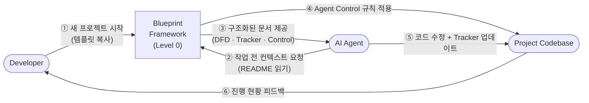

# Project Blueprint Framework

> AI 에이전트(Claude Code 등)가 프로젝트를 **정확하고 일관되게** 이해하고 수정할 수 있도록 설계된 문서 구조 표준입니다.

---

## DFD — Level 0 (Context Diagram)

> 이 레벨은 시스템 전체를 **하나의 프로세스**로 표현합니다. 외부 액터와 시스템 경계만 나타냅니다.  
> 하위 폴더의 README.md는 이 버블을 순차적으로 분해(Decompose)한 Level 1, Level 2 DFD를 가집니다.



### DFD 레벨 구조 (폴더 깊이 → DFD 레벨)

| 폴더 깊이 | 예시 경로 | DFD 레벨 | 표현 범위 |
|-----------|-----------|----------|-----------|
| 루트 `/` | `README.md` | **Level 0** — Context | 시스템 전체, 외부 액터 경계 |
| 1단계 | `/templates/` | **Level 1** — Main Processes | 루트 버블 분해, 주요 서브프로세스 |
| 2단계 | `/src/auth/` | **Level 2** — Detailed Processes | Level 1 버블 하나 분해, 모듈 내부 |
| 3단계+ | `/src/auth/handlers/` | **Level 3+** — Function Level | 함수/컴포넌트 수준 입출력 |

> **규칙**: 각 하위 DFD는 반드시 상위 DFD의 어느 버블을 분해한 것인지  
> `Decomposed from: [상위 경로] Level N` 으로 명시해야 합니다.

---

## 왜 이 프레임워크가 필요한가?

AI 에이전트는 단일 파일 수준에서는 탁월한 성능을 보이지만,  
**프로젝트 전체 맥락(Context)** 을 유지하면서 작업할 때 다음 문제가 발생합니다:

- 데이터 흐름을 오해해 의도치 않은 사이드 이펙트 발생
- 이미 구현된 기능을 중복 구현하거나 미구현 기능을 건너뜀
- 폴더별 아키텍처 원칙(Pure Function, 의존성 제한 등)을 무시

Blueprint Framework는 **각 폴더의 `README.md`를 에이전트의 컨텍스트 문서로 활용**합니다.  
에이전트가 작업 전 이 문서를 읽도록 강제함으로써 위 문제를 구조적으로 차단합니다.

### 세 가지 핵심 장치

| 장치 | 역할 |
|------|------|
| **DFD (Data Flow Diagram)** | 데이터 흐름을 시각화하여 에이전트가 흐름을 깨는 코드 작성 방지 |
| **Progress Tracker** | 기능 구현 현황을 테이블로 관리, 에이전트가 직접 업데이트 |
| **Agent Control** | 폴더별 행동 제약을 명시하여 에이전트의 System Prompt 역할 수행 |

---

## 레포지토리 구조

```
project-blueprint-framework/              ← Level 0 DFD (Context)
├── README.md                             # 이 파일 (Level 0 DFD 포함)
├── BLUEPRINT.md                          # 마스터 문서 (Level 1 DFD + 전체 명세)
├── CONTRIBUTING.md                       # 에이전트 행동 강령
└── templates/                            ← Level 1 DFD
    ├── README.md                         # templates 폴더 설명 (Level 1 DFD 포함)
    ├── README_TEMPLATE.md                # 폴더별 README 템플릿 (레벨 표시 포함)
    └── FOLDER_CHECKLIST.md               # 새 폴더 생성 시 체크리스트
```

---

## 빠른 시작

### 1. 새 프로젝트에 적용

이 레포지토리의 파일들을 프로젝트 루트에 복사한 뒤,  
Claude Code 첫 세션에 아래 프롬프트를 입력하세요:

```
이 프로젝트는 Blueprint Framework를 따릅니다.
새로운 폴더를 생성할 때마다 templates/README_TEMPLATE.md에 맞춰
README.md를 생성하고, 현재 내가 요청한 작업의 맥락에 맞게 DFD와 Progress Tracker를 작성해.
```

### 2. 각 폴더마다 README 생성

`templates/README_TEMPLATE.md`를 복사해 각 모듈/폴더의 `README.md`로 사용하세요.  
섹션별 작성 가이드는 `BLUEPRINT.md`를 참고하세요.

---

## 핵심 원칙

1. **에이전트는 작업 전 반드시 해당 폴더의 `README.md`를 읽는다**
2. **작업 완료 후 반드시 `Progress Tracker`를 업데이트한다**
3. **구조 변경 시 반드시 `DFD`를 최신 상태로 유지한다**

자세한 규칙은 [CONTRIBUTING.md](./CONTRIBUTING.md) 및 [BLUEPRINT.md](./BLUEPRINT.md)를 참고하세요.
