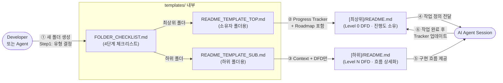

# templates — Overview

프로젝트 내 모든 폴더에서 재사용하는 **Blueprint Framework 표준 템플릿 파일**을 보관합니다.  
새 폴더 생성 시 이 폴더의 파일을 복사해 사용하며, 에이전트가 일관된 문서 구조를 생성하도록 안내합니다.

---

## DFD — Level 1 (Main Processes)

> Decomposed from: `/` Level 0 — `Blueprint Framework` 버블  
> 루트의 단일 버블 중 **"문서 구조 제공(Template Provision)"** 프로세스를 분해합니다.

---

## Tech Stack

- Markdown (CommonMark)
- mermaid (다이어그램 렌더링)

---

## Agent Control

> 이 섹션의 규칙은 에이전트가 `templates/` 폴더를 수정할 때 **반드시** 따라야 합니다.

### 허용 (Allow)

- `README_TEMPLATE.md` 내 플레이스홀더(`[[ ]]`) 구조 유지 하에 내용 보완
- `FOLDER_CHECKLIST.md`에 체크 항목 추가
- 기술 스택별 특화 템플릿 파일 추가 (예: `README_TEMPLATE_REACT.md`)

### 금지 (Prohibit)

- `README_TEMPLATE.md`의 섹션 순서 변경 금지 (Overview → DFD → Tech Stack → Agent Control → Tracker → Roadmap)
- DFD 레벨 표시(`## DFD — Level [N]`) 헤더 형식 임의 변경 금지
- `Decomposed from:` 줄 삭제 금지

### 필수 (Required)

- 템플릿 구조 변경 시 `BLUEPRINT.md §2`도 함께 업데이트
- 새 템플릿 파일 추가 시 이 `README.md`의 Progress Tracker에 반영
- DFD 수정 시 루트 `README.md`의 Level 0 DFD와 일관성 검토

---

<!--
  이 폴더(templates/)는 하위 폴더이므로 Progress Tracker와 Roadmap을 갖지 않습니다.
  진행도는 루트 README.md의 Progress Tracker에서 관리됩니다.
  아래는 이 폴더가 제공하는 파일 목록과 각 파일의 용도입니다.
-->

## 파일 목록

### 에이전트 세션 관리 (Agent Session Files)

| 파일 | 용도 | 수명 |
|------|------|------|
| `AGENT_BOOTSTRAP.md` | 최초 1회 읽고 삭제하는 초기화 파일 — 전체 규칙 요약 + AGENT_STATE 생성 지시 | **일회용** (읽고 즉시 삭제) |
| `AGENT_STATE.md` | 매 세션 읽고 갱신하는 경량 상태 파일 — 누적 요구사항·진행 현황·세션 로그 | **영구 유지** (세션마다 갱신) |
| `AGENT_STATE_ARCHIVE.md` | 누적 요구사항 20행 초과 시 오래된 항목을 이동하는 아카이브 파일 | **영구 유지** (자동 증가) |

### 폴더 README 템플릿 (Folder README Templates)

| 파일 | 용도 | 사용 수준 |
|------|------|-----------|
| `README_TEMPLATE_TOP.md` | Progress Tracker·Roadmap을 소유하는 최상위 폴더용 | 루트 또는 도메인 최상위 |
| `README_TEMPLATE_SUB.md` | Context·DFD·Agent Control만 갖는 하위 폴더용 | Level 1, 2, 3+ 모든 하위 |
| `FOLDER_CHECKLIST.md` | 새 폴더 생성 시 4단계 체크리스트 (유형 결정 → 항목 확인 → 상위 업데이트) | 폴더 생성 시마다 |
| `README_TEMPLATE.md` | (구버전) 레벨 미지정 범용 템플릿 — 신규 사용 비권장 | — |

### 프로젝트 적용 가이드 (Onboarding Guides)

| 파일 | 용도 |
|------|------|
| `FIRST_PROMPTS.md` | 프로젝트 유형별(React, Node API, Python, 풀스택) 첫 프롬프트 모음 — 복사해서 바로 사용 |
| `MIGRATION_GUIDE.md` | 기존 코드베이스에 프레임워크를 점진적으로 적용하는 3단계 가이드 |
