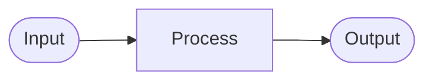

# [폴더명] — Overview

<!--
  ⛔ DEPRECATED — 이 템플릿은 더 이상 사용하지 않습니다.

  대체 템플릿:
    최상위(소유자) 폴더 → README_TEMPLATE_TOP.md
    하위(실행자) 폴더   → README_TEMPLATE_SUB.md

  이 파일은 하위 호환성을 위해 보존되며, 다음 메이저 버전에서 삭제됩니다.
  새 폴더 생성 시 반드시 위 대체 템플릿을 사용하세요.
-->

이 폴더는 **[[ 이 폴더의 주요 책임을 1문장으로 ]]** 을 담당합니다.  
[[ 추가 맥락이 필요하면 여기에 작성. 필요 없으면 삭제. ]]

---

## DFD — Level [[ N ]] ([[ 레벨명 ]])

<!--
  ① 이 폴더의 깊이에 맞는 레벨을 선택해 헤더를 교체하세요:
      루트(/)                     → Level 0 (Context Diagram)
      1단계 하위 (/src 등)        → Level 1 (Main Processes)
      2단계 하위 (/src/auth 등)   → Level 2 (Detailed Processes)
      3단계+ 하위                 → Level 3+ (Function Level)

  ② 반드시 아래 'Decomposed from' 줄을 채우세요.
      루트라면 이 줄을 삭제해도 됩니다.

  ③ 이 DFD의 외부 입력/출력은 상위 DFD 해당 버블의 화살표와 일치해야 합니다.
  
  ④ 구조 변경 시 이 섹션과 상위 폴더의 DFD를 함께 업데이트하세요.
  
  자세한 레벨링 규칙은 BLUEPRINT.md §3-1을 참고하세요.
-->

> Decomposed from: `[[ 상위 폴더 경로 ]]` Level [[ N-1 ]] — `[[ 상위 DFD에서 이 폴더에 해당하는 버블명 ]]` 버블

---

## Tech Stack

<!--
  이 폴더에서 사용하는 언어, 프레임워크, 라이브러리를 나열하세요.
  버전 정보를 포함하면 에이전트가 호환성 문제를 예방할 수 있습니다.
-->

- [[ 언어 / 런타임 버전 ]]
- [[ 프레임워크 및 버전 ]]
- [[ 주요 라이브러리 및 버전 ]]

---

## Agent Control

> 이 섹션의 규칙은 에이전트가 이 폴더의 코드를 수정할 때 **반드시** 따라야 합니다.

<!--
  BLUEPRINT.md의 §5 Agent Control 섹션 규칙을 참고해 작성하세요.
  이 폴더의 아키텍처 원칙에 맞게 구체적으로 기술할수록 효과가 높아집니다.
-->

### 허용 (Allow)

- [[ 허용되는 패턴, 라이브러리, 접근 방식 ]]

### 금지 (Prohibit)

- [[ 금지되는 패턴, 라이브러리, 접근 방식 ]]

### 필수 (Required)

- [[ 반드시 해야 하는 행동 (예: DFD 업데이트, 테스트 작성 등) ]]

---

## Progress Tracker

<!--
  에이전트는 작업 시작 시 🔄, 완료 시 ✅로 상태를 변경해야 합니다.
  새 기능 발견 시 새 행을 추가하세요.
  상태 이모지: ✅ Done | 🔄 In Progress | ⏳ Pending | ❌ Blocked
-->

| Feature | Status | Assignee | Last Updated | Notes |
|---------|--------|----------|--------------|-------|
| [[ 기능명 ]] | ⏳ Pending | - | - | |

---

## Next Roadmap

<!--
  에이전트는 작업 완료 후 이 섹션을 갱신해야 합니다.
  완료된 항목은 삭제하고, 새 항목을 우선순위 순으로 추가하세요.
-->

1. [[ 다음 작업 항목 1 ]]
2. [[ 다음 작업 항목 2 ]]
