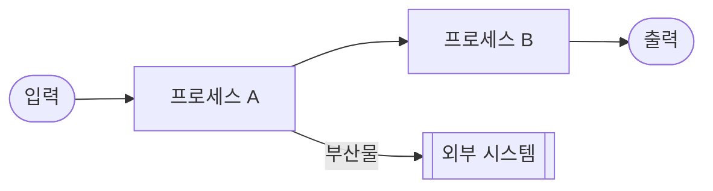

# [폴더명] — Overview

<!--
  이 템플릿은 하위 폴더 전용입니다.
  Progress Tracker와 Roadmap은 이 폴더에 없습니다 — 최상위 폴더가 소유합니다.
  이 폴더의 역할은 상위에서 정의된 작업을 받아 DFD로 상세화하는 것입니다.

  사용 수준:
    Level 1 — /src, /api, /auth 등 도메인 첫 번째 하위 폴더
    Level 2 — /src/auth, /api/users 등 두 번째 하위 폴더
    Level 3+ — 더 깊은 하위 폴더
-->

<!--
  ┌─ 상위 연결 정보 (필수) ──────────────────────────────────────────┐
  │ 상위 Tracker 항목: [상위 README.md]의 Progress Tracker 중        │
  │                   이 폴더가 담당하는 Feature명                    │
  │ 분해 대상 버블:    상위 DFD에서 이 폴더에 해당하는 버블명          │
  └──────────────────────────────────────────────────────────────────┘
-->

> **상위 작업 연결**: `[[ 상위 폴더 경로 ]]/README.md` Progress Tracker의  
> `[[ 담당 Feature명 ]]` 항목을 구현합니다.

이 폴더는 **[[ 이 폴더의 구체적 책임을 1~2문장으로 ]]** 을 담당합니다.

---

## Context — 상위 흐름과의 연결

<!--
  이 섹션은 하위 폴더 README에만 존재합니다.
  상위 DFD에서 이 폴더가 어느 버블인지, 무엇을 받아서 무엇을 돌려주는지 명시합니다.
  에이전트는 이 섹션을 읽고 자신의 작업 범위를 상위 흐름 안에서 위치시켜야 합니다.
-->

```
[[ 상위 폴더 ]] — Level [[ N-1 ]] DFD
└─ [[ 상위 DFD에서 이 폴더에 해당하는 버블명 ]] 버블
       │  입력: [[ 상위에서 이 폴더로 들어오는 데이터/트리거 ]]
       ▼
[[ 현재 폴더 ]] — Level [[ N ]] DFD (아래 상세)
       │  출력: [[ 이 폴더에서 상위로 돌려주는 데이터/결과 ]]
       ▼
[[ 다음 버블 또는 외부 액터 ]]
```

---

## DFD — Level [[ N ]] ([[ 레벨명 ]])

<!--
  레벨 선택:
    Level 1 (Main Processes)    — 루트의 단일 버블을 서브시스템으로 분해
    Level 2 (Detailed Processes)— Level 1 버블 하나를 모듈 내부로 분해
    Level 3+ (Function Level)   — 함수/컴포넌트 수준 입출력

  ⚠️ 이 DFD의 외부 입력/출력은 위 Context 섹션의 입력/출력과 반드시 일치해야 합니다.
  ⚠️ 새 외부 의존성 추가 시 상위 폴더 DFD도 함께 업데이트하세요.
-->

> Decomposed from: `[[ 상위 폴더 경로 ]]` Level [[ N-1 ]] — `[[ 버블명 ]]` 버블



---

## Tech Stack

<!--
  이 폴더에서 추가로 사용하는 기술만 기재합니다.
  상위 폴더에서 이미 명시한 스택은 중복 기재하지 않습니다.
-->

- [[ 이 폴더 특화 라이브러리 및 버전 ]]

---

## Agent Control

<!--
  이 섹션은 상위 폴더 Agent Control을 '상속'하며 추가 제약을 정의합니다.
  상위 규칙보다 완화하는 방향으로 작성할 수 없습니다.
-->

> 상위 규칙 참조: `[[ 상위 폴더 경로 ]]/README.md` — Agent Control  
> 아래 규칙은 이 폴더에 추가 적용됩니다.

### 허용 (Allow)

- [[ 이 폴더 수준에서 추가로 허용되는 패턴 ]]

### 금지 (Prohibit)

- [[ 이 폴더 수준에서 추가로 금지되는 패턴 ]]

### 필수 (Required)

- 작업 완료 시 `[[ 상위 폴더 경로 ]]/README.md` Progress Tracker 업데이트
- 이 폴더 내 구조 변경 시 위 DFD와 상위 DFD 동시 업데이트
- [[ 이 폴더 수준의 추가 필수 행동 ]]
