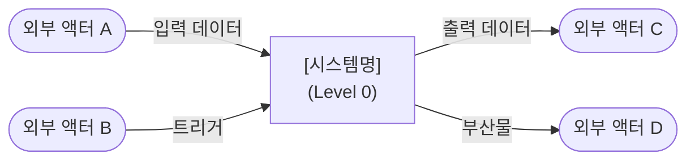

# [프로젝트/모듈명] — Overview

<!--
  이 템플릿은 Progress Tracker와 Roadmap을 '소유'하는 최상위 폴더 전용입니다.
  하위 폴더는 이 파일을 참조하며, 자체 Tracker를 갖지 않습니다.
  사용 수준: 루트(/) 또는 주요 도메인의 최상위 폴더 (예: /src, /api 최상단)
-->

이 시스템은 **[[ 전체 책임을 1~2문장으로 ]]** 을 담당합니다.

---

## DFD — Level 0 (Context Diagram)

> 시스템 전체를 단일 버블로 표현합니다. 외부 액터와 시스템 경계만 나타냅니다.  
> 하위 폴더의 DFD는 이 버블을 순차적으로 분해(Decompose)합니다.

---

## Tech Stack

<!--
  이 시스템 전체에서 사용하는 언어, 프레임워크, 인프라를 나열하세요.
  하위 폴더별 특화 스택은 해당 폴더의 README에서 명시합니다.
-->

- [[ 언어 / 런타임 버전 ]]
- [[ 프레임워크 및 버전 ]]
- [[ 인프라 / 외부 서비스 ]]

---

## Agent Control

<!--
  이 섹션의 규칙은 이 폴더 및 모든 하위 폴더에 기본 적용됩니다.
  하위 폴더의 Agent Control은 이 규칙을 '상속'하며 추가/강화할 수 있습니다.
-->

> 이 규칙은 전체 시스템에 적용되는 최상위 제약입니다. 하위 폴더는 이 규칙을 위반할 수 없습니다.

### 허용 (Allow)

- [[ 시스템 전반에서 허용되는 패턴 ]]

### 금지 (Prohibit)

- [[ 시스템 전반에서 금지되는 패턴 ]]

### 필수 (Required)

- 모든 하위 폴더 작업 완료 시 이 파일의 **Progress Tracker** 업데이트
- 새 폴더 생성 시 `templates/README_TEMPLATE_SUB.md` 기반으로 README.md 작성
- 구조 변경 시 관련 레벨의 DFD를 상위→하위 순서로 업데이트

---

## Sub-folder Map

<!--
  이 시스템의 하위 폴더 구조와 각 폴더가 담당하는 Tracker 항목을 매핑합니다.
  새 폴더 추가 시 반드시 이 테이블에 행을 추가하세요.
-->

| 폴더 | DFD 레벨 | 담당 Tracker 항목 | 설명 |
|------|----------|--------------------|------|
| `/[[ 폴더명 ]]` | Level 1 | [[ Tracker Feature명 ]] | [[ 한 줄 설명 ]] |

---

## Progress Tracker

<!--
  ⚠️ 진행도의 단일 정의 지점(Single Source of Truth)입니다.
  모든 하위 폴더는 이 테이블을 참조하며, 직접 Tracker를 갖지 않습니다.

  에이전트는:
  - 어떤 하위 폴더의 작업을 시작할 때 → 해당 Feature를 🔄 In Progress로 변경
  - 작업 완료 시                      → ✅ Done + Last Updated 갱신
  - 새 작업 발견 시                   → 새 행 추가 (⏳ Pending)
  - Owner Folder는 실제 구현 위치 폴더 경로를 기재

  상태 이모지: ✅ Done | 🔄 In Progress | ⏳ Pending | ❌ Blocked
-->

| Feature | Status | Owner Folder | Last Updated | Notes |
|---------|--------|--------------|--------------|-------|
| [[ 기능명 A ]] | ⏳ Pending | `/[[ 폴더 ]]` | - | |
| [[ 기능명 B ]] | ⏳ Pending | `/[[ 폴더 ]]` | - | |

---

## Next Roadmap

<!--
  ⚠️ 작업 방향성의 단일 정의 지점입니다.
  하위 폴더는 자체 Roadmap을 갖지 않으며, 이 목록을 보고 자신의 DFD를 구성합니다.
  완료된 항목은 삭제하고, 새 항목을 우선순위 순으로 추가하세요.
  각 항목 옆에 담당 하위 폴더 경로를 명시하세요.
-->

1. [[ 작업 항목 1 ]] → `/[[ 담당 폴더 ]]`
2. [[ 작업 항목 2 ]] → `/[[ 담당 폴더 ]]`
